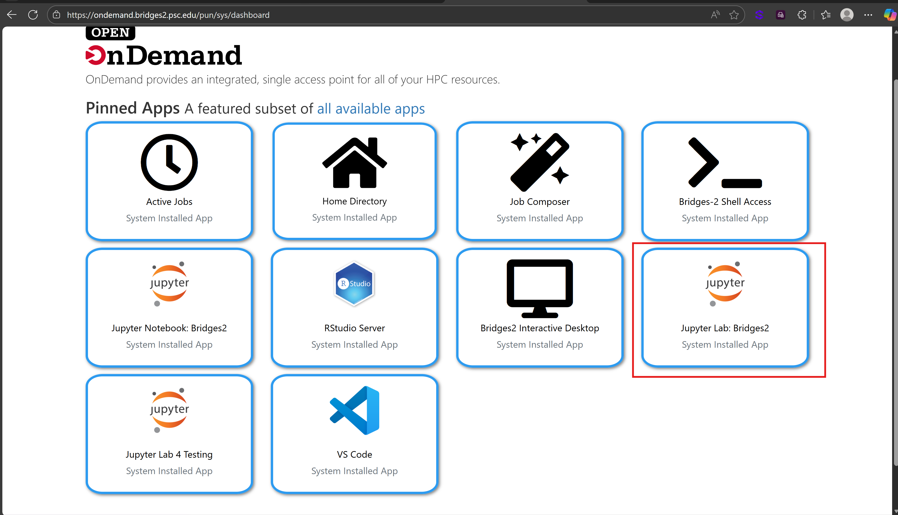

<a id="readme-top"></a>

<h3 align="center">CPRA - Jupyter Notebook User Guide</h3>

  <p align="center">
    This repository contains standardized Python Jupyter notebook templates that can be utilized to pull data from the Master Plan API to visualize and analyze the outputs of the ICM, CLARA, and PT models that are not currently visualized in the QAQC Portal. These templates aim to streamline the process of data extraction, transformation, visualization, and analysis, enabling users to perform these tasks efficiently and consistently. The templates serve as a staging ground for future QAQC Portal development.  
    <br />
    <a href="https://coastal.la.gov/our-plan/"><strong>Louisiana’s Coastal Master Plan »</strong></a>
    <br />
    <br />
  </p>
</div>


<!-- TABLE OF CONTENTS -->
<details>
  <summary>Table of Contents</summary>
  <ol>
    <li>
      <a href="#getting-started">Getting Started with Jupyter Notebooks and IDE</a>
      <ul>
        <li><a href="#jupyter-lab-set-up">Jupyter Lab Set Up</a></li>
      </ul>
    </li>
    <li><a href="#naming-conventions">Naming Conventions</a></li>
    <li>
      <a href="#explore-template-notebooks">Explore Template Notebooks</a>
      <ul>
        <li><a href="#master-plan-data-package">Master Plan Data Package</a></li>
        <li><a href="#crosswalk-grids">Crosswalk Grids</a></li>
      </ul>
    </li>
    <li><a href="#github-management">GitHub Management</a>
        <ul>
        <li><a href="#strip-notebook-outputs">Strip Notebook Ouputs</a></li>
        <li><a href="#additional-package-requirements">Additional Package Requirements</a></li>
      </ul>
    </li>
    <li><a href="#project-structure">Project Structure</a></li>
  </ol>
</details>

<!-- GETTING STARTED -->
### Getting Started with Jupyter Notebooks and IDE

There are two options for accessing Jupyter Notebooks:
- **OnDemand Jupyter Lab**
  - Connect to CPRA Master Plan kernel
- **OnDemand VSCode Server**
  - Connect to CPRA Master Plan kernel

#### Jupyter Lab Set Up

1) Log in to [Bridges-2 Open OnDemand](https://ondemand.bridges2.psc.edu/) with your PSC credentials.
2) Choose Jupyter Lab: Bridges-2.

    

3) Enter the settings shown below. Be sure to use the RM-shared partition unless you want a whole node (128 cores). You can also adjust the `--ntasks-per-node=1` parameter to specify the number of cores you want. 1 or 2 cores is probably enough to get started.
4) This step only needs to be done the first time you log into OnDemand: From the File menu, choose New -> Terminal. In the terminal run this script: `/ocean/projects/bcs200002p/shared/jupyter/setup.sh`. This will install the custom Python kernel Matt Yoder created and make a link to the shared jupyter directory in your home directory on Bridges-2. After running the script, refresh your browser as instructed in the script output.
5) In the Jupyter file browser, browse to the jupyter link created in the previous step and open the `read_data_example.ipynb` notebook (or create a new notebook). Be sure to run the notebook using the CPRA Master Plan (Python) kernel, which includes the `cpra.mp.data` library and its dependencies. 

### Naming Conventions

When creating new notebooks for your analyses, please follow these conventions to keep things organized and easily searchable. The naming structure should be general project followed by a brief description of the notebook's content (e.g., `generalpurpose_detail.ipynb`). The general purpose can be qaqc, analysis etc., and the detail should provide a brief description of what the code does. Examples include: qaqc_salinity_veg_investigation.ipynb, analysis_project_benefits.ipynb

### Explore Template Notebooks

Review example notebooks to learn best practices on accessing/manipulating data

#### Template Notebook One `templates/scenario_one_v4.ipynb` Description:

The Salinity Analysis notebook aims to demonstrate a few different functionalities provided by the cpra.mp.data package and raster data. The main goal of this notebook is to identify areas where salinity levels have exceeded a certain threshold and have caused the die-off of freshwater marsh vegetation.

#### Template Notebook Two Description:

This notebook demonstrates a project-level cost-benefit analysis through map display functionalities and timeseries plots are demonstrated.

### Master Plan Data Package

The [cpra.mp.data](https://github.com/pscedu/cpra.mp.data) package reads and writes data pertaining to the CPRA Master Plan.

### Crosswalk Grids

For ease of use, several single band crosswalks were developed.

>[!IMPORTANT]
>The naming convention for CPRA crosswalks is: GridCellSize__IdCastOn.tif. For example, `veg_grid_cell_v001__hydro_compartment_v001.tif` contains the v001 hydrocompartment id values cast on to the veg grid cells. All rasters and csvs can be found in shared/grid folder

| Name | File Name | Grid Cell | Id Cast On |
| ---- | --------- | --------- | ---------- |
| Morph-Hydro Raster | morph_pixel_v001__hydro_compartment_v001.tif | Morph Pixel | Hydrocompartment Id |
| Morph-Veg Raster | morph_pixel_v001__veg_grid_cell_v001.tif | Morph Pixel | Veg Grid Cell Id |
| Veg-Hydro Raster | veg_grid_cell_v001__hydro_compartment_v001.tif | Veg Grid Cell | Hydrocompartment Id |
| Veg-EcoRegion Raster | veg_grid_cell_v001__ecoregion_v001.tif | Veg Grid Cell | EcoRegion Id |

*In Development:* 
- [ ] Morph -> region
- [ ] Morph -> ecoregion
- [ ] Morph -> hydro compartment
- [ ] Veg -> region
- [ ] Veg-> ecoregion
- [ ] Veg -> hydro compartment

## GitHub Management

This repository is managed on GitHub, changes and additions to the notebooks are automatically pushed daily from Bridges-2. Additionally, the repository utilizes [`nbstripout`](https://pypi.org/project/nbstripout/) to remove output cells for cleaner version control.

### Strip Notebook Outputs

This repository uses `nbstripout` to remove output cells from Jupyter Notebooks before committing them to the repository. This helps keep the repository clean and reduces file size. To set up `nbstripout` in your local environment, follow these steps:

1. Install `nbstripout` using conda: `conda install -c conda-forge nbstripout`
2. Navigate to the repository directory in your terminal.
3. Run the command: `nbstripout --install`

### Daily Push from Bridges-2


### Additional Package Requirements

- IF YOU NEED TO play around with new libraries for manipulating data:
  - Create a conda environment in your personal folder on bridges using standard python version 
  - Test/figure out workflow
  - Confer with matt on adding to the Kernal if needed
- If this is something that ultimately will go into QAQC portal workflow
  - Confer with Matt on development plan

_For more documentation, please refer to the [PSC Bridges-2 User Guide](https://www.psc.edu/resources/bridges-2/user-guide/)_

<p align="right">(<a href="#readme-top">back to top</a>)</p>

<!-- Project Structure  -->
## Project Structure

```
notebooks/
├── icm/                                           # ICM-related notebooks
├── clara/                                         # CLARA-related notebooks
├── pct/                                           # CLARA-related notebooks
├── cma/                                           # CLARA-related notebooks
├── templates/                                     # Sample/template notebooks for common workflows
│   └── scenario_one_v4.ipynb                      # Salinity & vegetation die-off analysis example
├── images/                                        # Screenshot/documentation images
├── README.md                                      # This file
└── LICENSE                                        # Project license
```
<p align="right">(<a href="#readme-top">back to top</a>)</p>

<!-- MARKDOWN LINKS & IMAGES -->
<!-- https://www.markdownguide.org/basic-syntax/#reference-style-links -->
[product-screenshot]: images/screenshot.png
[Python.js]: https://www.python.org/static/community_logos/python-powered-w-140x56.png
[Python-url]: https://www.python.org/